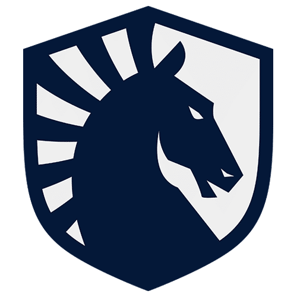
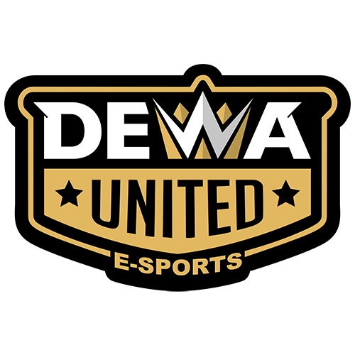
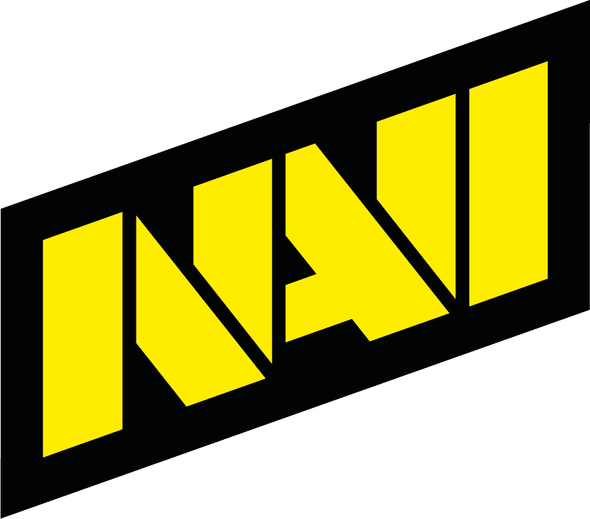

<div align="center">


# MPL Indonesia Dashboard

**Nine MPL Indonesia seasons in one research-ready dataset and interactive dashboard.**

680 matches · 1,611 games · 32,219 picks & bans · 320 players · 135 heroes.

<p>
  
  
  
  
</p>

<p>
  
  
  
  
</p>

</div>

---

<div align="center">

&nbsp;&nbsp;
&nbsp;&nbsp;
&nbsp;&nbsp;
&nbsp;&nbsp;
&nbsp;&nbsp;
&nbsp;&nbsp;
&nbsp;&nbsp;
&nbsp;&nbsp;
&nbsp;&nbsp;
&nbsp;&nbsp;


<sub>ONIC · RRQ Hoshi · Bigetron by VIT · EVOS · Alter Ego · Team Liquid ID · Dewa United · NAVI · Geek Fam ID · AURA Fire · Rebellion Esports</sub>

</div>

## Overview

MPL Indonesia Datasets turns public MPL data into a structured archive for analysis, research, and visual exploration. It combines historical data from Liquipedia (S10–S17) with the current season from the official MPL Indonesia website (S18).

The project includes a simple static dashboard for standings, schedules, playoffs, awards, rosters, team and player statistics, drafts, and hero meta. The same cleaned data is also available in a query-ready SQLite database.

## Highlights

| Area | Includes |
|---|---|
| Dashboard | Standings, weekly rank movement, schedule, head-to-head, playoffs, awards, and rosters |
| Teams & players | Season filters, search, win rate, KDA, objectives, playoff qualification, and titles |
| Draft & hero meta | Per-game picks/bans, hero picks, bans, W/L, win rate, allies, and opponents |
| Research database | 16 strict SQLite tables, 9 analytical views, foreign keys, checks, and example queries |
| Data quality | Cross-source validation, relational integrity checks, and source provenance |

## Explore the dashboard

The generated dashboard is a static website, so it can be opened locally or deployed to any static host.

```bash
python build_site.py
python -m http.server 8765 --directory site
```

Open [http://localhost:8765](http://localhost:8765).

## Database at a glance

`database/mpl.db` is the ready-to-query research artifact. It is built from normalized CSV tables and protected by strict types, primary keys, foreign keys, and checks.

```bash
sqlite3 database/mpl.db
python database/build.py --periksa
```

```python
import sqlite3
import pandas as pd

connection = sqlite3.connect("database/mpl.db")
standings = pd.read_sql("SELECT * FROM v_klasemen WHERE season = 17", connection)
```

| Dataset | Rows |
|---|---:|
| Matches | 680 |
| Games | 1,611 |
| Pick / ban records | 32,219 |
| Hero relationships | 6,292 |
| Roster records | 809 |
| Awards | 611 |

For the entity map, data dictionary, conventions, and research notes, see [database/README.md](database/README.md).

## Project structure

```text
.
├── mpl_scraper.py          # Current-season MPL Indonesia scraper
├── liquipedia_scraper.py   # Historical MPL Indonesia scraper
├── dataset.py              # Unified data model and calculations
├── build_dataset.py        # Normalized dataset builder
├── build_site.py           # Static dashboard builder
├── validate.py             # Cross-source validation
├── site/                   # Generated dashboard and local assets
└── database/
    ├── mpl.db              # Query-ready SQLite database
    ├── schema.sql          # 16 strict tables, keys, checks, indexes
    ├── views.sql           # 9 analytical views
    ├── build.py            # Database builder and verifier
    └── queries/            # Example research queries
```

## Build from source

```bash
# Install dependencies
python -m pip install requests beautifulsoup4 lxml pandas

# Refresh current MPL Indonesia data
python mpl_scraper.py --scrape

# Build and validate the normalized dataset
python build_dataset.py --periksa
python validate.py

# Build the dashboard and SQLite database
python build_site.py
python database/build.py
```

> Before scraping Liquipedia again, replace the contact placeholder in `liquipedia_scraper.py` with your own contactable email address or URL. Liquipedia requires an identifiable User-Agent and the scraper respects its 30-second request interval.

## Data coverage and limitations

- Coverage currently starts at **Season 10**; Seasons 1–9 are not included.
- Per-game winner labels and player-to-hero assignments are not yet stored, so draft outcome analysis is limited to available aggregates.
- Player KDA and objective statistics are currently available for the ongoing season only.
- Historical data is source-dependent; always inspect coverage before comparing seasons.

## Attribution and license

| Component | License / source |
|---|---|
| Historical data (S10–S17) | [Liquipedia](https://liquipedia.net/mobilelegends/), [CC BY-SA 3.0](https://creativecommons.org/licenses/by-sa/3.0/) |
| Current season data (S18) | [MPL Indonesia / id-mpl.com](https://id-mpl.com) |
| Project code | License not specified yet |
| Team and MPL logos | Trademarks of their respective owners, used for identification |

This project is unofficial, non-commercial, and not affiliated with Moonton, MPL Indonesia, Liquipedia, or the teams represented here. Any reuse of Liquipedia-derived data must preserve its CC BY-SA 3.0 attribution and share-alike requirements.

<div align="center">

Made by [@agaollineed](https://github.com/agaollineed)

</div>
